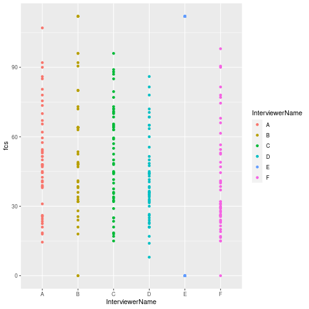
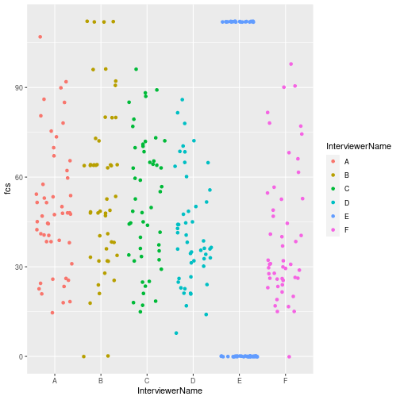
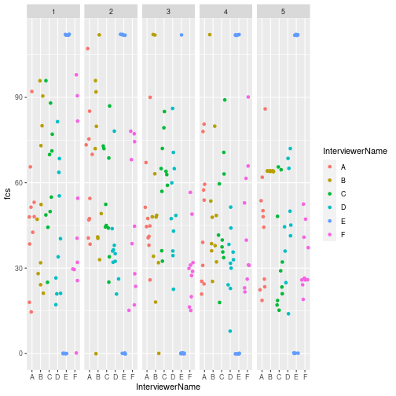
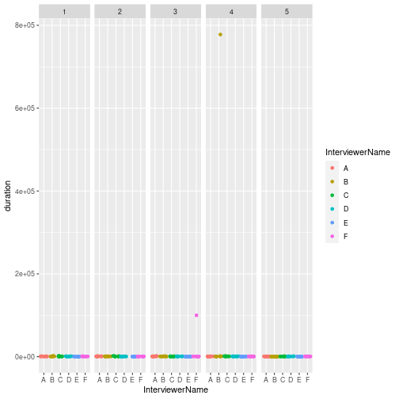
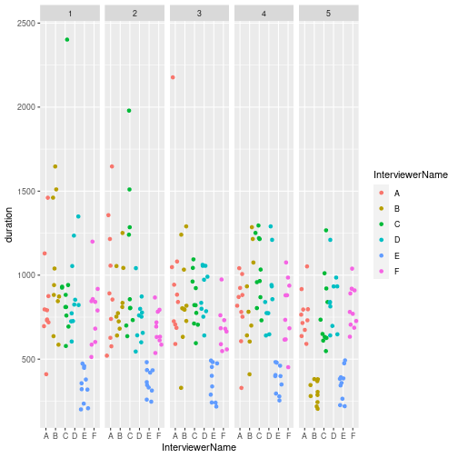

In this quick tutorial, I share a simple method to graphically display information to monitor data quality of survey teams using a little bit of dplyr and ggplot2
<!--MORE-->
  
  

There is a lot to be said and done about data quality monitoring. Here is just one simple method to graphically observe “curb-stoning” or “flat-lining” - when enumerators stop administering/recording real questions and responses and instead start making up answers. Often fictious responses are not random and can sometimes be detected graphically.

## Installing packages

To get started, if you don’t have them already, the following packages are necessary: readr dplyr ggplot2


```r
## Getting all necessary package

using <- function(...) {
  libs <- unlist(list(...))
  req <- unlist(lapply(libs,require,character.only = TRUE))
  need <- libs[req == FALSE]
  if (length(need) > 0) { 
    install.packages(need)
    lapply(need,require,character.only = TRUE)
  }
}


using("readr","dplyr","ggplot2")
```

```
## Loading required package: readr
```

```
## Loading required package: dplyr
```

```
## 
## Attaching package: 'dplyr'
```

```
## The following objects are masked from 'package:stats':
## 
##     filter, lag
```

```
## The following objects are masked from 'package:base':
## 
##     intersect, setdiff, setequal, union
```

```
## Loading required package: ggplot2
```


## Downloading data

Ideally, to monitor data quality, you’ll want to get the data as quickly and in way as automated as possible. One of the cool things about R is you can access data in all kinds of ways including grabbing it from APIs or urls (not included in this tutorial but worth checking out is the odkr package for getting data from open data kit setups).

In this example, we’ll use readr to connect to a .csv file from a dropbox folder. Assuming we get a share link: https://www.dropbox.com/s/cypl442oxjiohgq/dataqualityexample.csv?dl=0 , it’s super easy to pull in the data.

One important detail is we have to change the last part of the link from `?dl=0` to `?dl=1` ; read why on the [Dropbox Force download page](https://help.dropbox.com/files-folders/share/force-download).

Anyway, let’s load the package readr and pull dataqualityexample.csv

```r
library(readr)

dataqualityexample <- read_csv("https://www.dropbox.com/s/rnbykbfxeenrbqc/dataqualityexample.csv?dl=1")
```

```
## Parsed with column specification:
## cols(
##   RspID = col_double(),
##   InterviewerName = col_character(),
##   FCSStap = col_double(),
##   FCSPulse = col_double(),
##   FCSDairy = col_double(),
##   FCSPr = col_double(),
##   FCSVeg = col_double(),
##   FCSFruit = col_double(),
##   FCSFat = col_double(),
##   FCSSugar = col_double(),
##   duration = col_double(),
##   day = col_double()
## )
```

next, let’s use glimpse to take a look at the data set

```r
library(dplyr)

glimpse(dataqualityexample)
```

```
## Rows: 300
## Columns: 12
## $ RspID           <dbl> 5036892796, 85457240718, 21242646525, 30133725215, 78…
## $ InterviewerName <chr> "A", "A", "A", "A", "A", "A", "A", "A", "A", "A", "A"…
## $ FCSStap         <dbl> 6, 5, 6, 3, 4, 6, 5, 6, 7, 4, 7, 7, 6, 5, 6, 7, 6, 7,…
## $ FCSPulse        <dbl> 2, 2, 5, 0, 0, 0, 3, 5, 2, 2, 6, 3, 1, 4, 5, 2, 4, 3,…
## $ FCSDairy        <dbl> 7, 4, 0, 0, 0, 2, 0, 0, 0, 0, 7, 3, 0, 5, 0, 0, 0, 6,…
## $ FCSPr           <dbl> 7, 3, 7, 0, 0, 4, 4, 1, 5, 7, 7, 7, 4, 3, 3, 4, 1, 4,…
## $ FCSVeg          <dbl> 5, 4, 6, 2, 6, 6, 5, 5, 6, 3, 6, 4, 5, 4, 5, 6, 4, 3,…
## $ FCSFruit        <dbl> 6, 0, 1, 3, 1, 2, 0, 0, 1, 0, 6, 3, 2, 6, 0, 3, 2, 1,…
## $ FCSFat          <dbl> 7, 6, 7, 7, 6, 6, 5, 5, 7, 6, 7, 7, 5, 7, 6, 5, 7, 7,…
## $ FCSSugar        <dbl> 7, 4, 0, 0, 0, 2, 0, 0, 2, 0, 7, 4, 0, 5, 0, 0, 2, 6,…
## $ duration        <dbl> 1461, 719, 791, 875, 696, 796, 410, 1129, 736, 730, 5…
## $ day             <dbl> 1, 1, 1, 1, 1, 1, 1, 1, 1, 1, 2, 2, 2, 2, 2, 2, 2, 2,…
```


In our sample database we have the following variables:
  
  | Variable    | Definition                                            | 
  |:------------|:------------------------------------------------------|
  |RspID 	      |anonymized unique identifier of the respondent
|InterviwerName| 	anonymized unique identifier of the enumerator
|FCSStap 	  | number of days staples were consumed in the last seven days
|FCSPulse 	| number of days pulses were consumed in the last seven days
|FCSDairy 	| number of days dairy were consumed in the last seven days
|FCSPr 	    | number of days protein were consumed in the last seven days
|FCSVeg 	  | number of days vegetable were consumed in the last seven days
|FCSFruit 	| number of days fruits were consumed in the last seven days
|FCSFat 	  |number of days fats/oils were consumed in the last seven days
|FCSSugar 	|number of days sugars were consumed in the last seven days
|duration 	| completion time of the survey (in seconds - this is often the format in ODK surveys)
|day        |	day survey was completed


### Looking at the Food Consumption Score by Interviewer

First, let’s use mutate to calculate the Food Consumption Score (https://resources.vam.wfp.org/node/13) for each interview :
  
  
  ```r
  dataqualityexample <- dataqualityexample %>%
  mutate(fcs = FCSStap * 2 + 
           FCSPulse * 3 + 
           FCSDairy  * 4 + 
           FCSPr * 4 + 
           FCSVeg + 
           FCSFruit + 
           FCSFat * .5 + 
           FCSSugar * .5)
  ```

Now, we can use the ggplot2 package to visualize the frequency of Food Consumption Score entries by interviwer. We can get a sense of the frequency of FCS submissions from each interviewer by plotting each FCS submission by interviewer as a point.


```r
library(ggplot2)

dataqualityexample %>% ggplot(aes(x = InterviewerName, y = fcs, color = InterviewerName)) +
  geom_point() 
```



Here’s the cool trick, we can also `jitter` (or add a tiny bit of random noise to the points so they stand apart) the points a little bit to help us get a better sense of the frequency.


```r
library(ggplot2)

dataqualityexample %>% ggplot(aes(x = InterviewerName, y = fcs, color = InterviewerName)) +
  geom_jitter() 
```



Q: How many suspicious entries do you spot?
  
  A: Interviewer E’s submissions look suspicious. Let’s take a quick at some of their entries:
  
  
  ```r
  dataqualityexample %>% filter(InterviewerName == "E") %>%
  glimpse()
  ```
  
  ```
  ## Rows: 50
  ## Columns: 13
  ## $ RspID           <dbl> 24886070837, 90127115839, 21143007227, 84240231374, 8…
  ## $ InterviewerName <chr> "E", "E", "E", "E", "E", "E", "E", "E", "E", "E", "E"…
  ## $ FCSStap         <dbl> 7, 0, 7, 0, 7, 0, 7, 0, 7, 0, 7, 0, 7, 0, 7, 0, 7, 0,…
  ## $ FCSPulse        <dbl> 7, 0, 7, 0, 7, 0, 7, 0, 7, 0, 7, 0, 7, 0, 7, 0, 7, 0,…
  ## $ FCSDairy        <dbl> 7, 0, 7, 0, 7, 0, 7, 0, 7, 0, 7, 0, 7, 0, 7, 0, 7, 0,…
  ## $ FCSPr           <dbl> 7, 0, 7, 0, 7, 0, 7, 0, 7, 0, 7, 0, 7, 0, 7, 0, 7, 0,…
  ## $ FCSVeg          <dbl> 7, 0, 7, 0, 7, 0, 7, 0, 7, 0, 7, 0, 7, 0, 7, 0, 7, 0,…
  ## $ FCSFruit        <dbl> 7, 0, 7, 0, 7, 0, 7, 0, 7, 0, 7, 0, 7, 0, 7, 0, 7, 0,…
  ## $ FCSFat          <dbl> 7, 0, 7, 0, 7, 0, 7, 0, 7, 0, 7, 0, 7, 0, 7, 0, 7, 0,…
  ## $ FCSSugar        <dbl> 7, 0, 7, 0, 7, 0, 7, 0, 7, 0, 7, 0, 7, 0, 7, 0, 7, 0,…
  ## $ duration        <dbl> 357, 379, 235, 474, 319, 459, 201, 321, 448, 208, 420…
  ## $ day             <dbl> 1, 1, 1, 1, 1, 1, 1, 1, 1, 1, 2, 2, 2, 2, 2, 2, 2, 2,…
  ## $ fcs             <dbl> 112, 0, 112, 0, 112, 0, 112, 0, 112, 0, 112, 0, 112, …
  ```


It looks like Interviewer E is only entering 0s or 7s for the food group questions. This is highly suspect.

But more subtly, it looks like Interviewer B has a little bit of clustering of digits. We can break apart the entries by day of survey with `facet_grid()`


```r
dataqualityexample %>% ggplot(aes(x = InterviewerName, y = fcs, color = InterviewerName)) + 
  geom_jitter() +
  facet_grid( . ~ day) 
```



It looks like Interviewer B entered in all the same digits on day 5. Let’s take a glimpse of the data for Interviewer B for day 5, to confirm.


```r
dataqualityexample %>% filter(InterviewerName == "B" & day == 5) %>% 
  glimpse()
```

```
## Rows: 10
## Columns: 13
## $ RspID           <dbl> 56489158342, 23193537084, 80555251173, 40014426998, 9…
## $ InterviewerName <chr> "B", "B", "B", "B", "B", "B", "B", "B", "B", "B"
## $ FCSStap         <dbl> 4, 4, 4, 4, 4, 4, 4, 4, 4, 4
## $ FCSPulse        <dbl> 4, 4, 4, 4, 4, 4, 4, 4, 4, 4
## $ FCSDairy        <dbl> 4, 4, 4, 4, 4, 4, 4, 4, 4, 4
## $ FCSPr           <dbl> 4, 4, 4, 4, 4, 4, 4, 4, 4, 4
## $ FCSVeg          <dbl> 4, 4, 4, 4, 4, 4, 4, 4, 4, 4
## $ FCSFruit        <dbl> 4, 4, 4, 4, 4, 4, 4, 4, 4, 4
## $ FCSFat          <dbl> 4, 4, 4, 4, 4, 4, 4, 4, 4, 4
## $ FCSSugar        <dbl> 4, 4, 4, 4, 4, 4, 4, 4, 4, 4
## $ duration        <dbl> 287, 346, 381, 381, 369, 305, 205, 280, 244, 219
## $ day             <dbl> 5, 5, 5, 5, 5, 5, 5, 5, 5, 5
## $ fcs             <dbl> 64, 64, 64, 64, 64, 64, 64, 64, 64, 64
```


Yes, it seems that Interviewer B entered 4s for each of the food group questions on day 5.

### Looking at the duration of by Interviewer

We can use the same method above to display the frequency of duration time of the survey by interviewer to give us addition.

Let’s give it a shot.

```r
dataqualityexample %>% ggplot(aes(x = InterviewerName, y = duration, color = InterviewerName)) +  
  geom_jitter() +
  facet_grid( . ~ day) 
```



As is often the case, we have a few outliers distorting our picture. Let’s filter out the outliers and try again.

```r
dataqualityexample %>% filter(duration < 25000) %>%
  ggplot(aes(x = InterviewerName, y = duration, color = InterviewerName)) +
  geom_jitter() +
  facet_grid( . ~ day) 
```



Here, we see that Interviewer E is completing surveys more quickly than others and Interviewer B started completing surveys much more quickly on day 5.


### So what?

Considering the entry patterns and submission times, it would be wise to call the supervisors of Interviewers B and E to observe their entries, investigate and take corrective action.
Some thoughts

A simple visualization could be presented to enumerators at the time of training and pilot data testing to give them the idea that their entries will be monitored and reviewed and not just sent to a black hole.

Although based on real experiences, these examples are a bit facile. In reality, you might not see such clear “smoking guns”. Also, although this tutorial is worded very accusatorially be careful not to unduly accuse enumerators of cheating. A lot happens in the field and there could be many valid explanations for abnormal entries or a misunderstanding of questions or malfunctioning of the survey tool.

It’s important to catch problems as early as you can so to take corrective action. As survey time goes on, so does fatigue, and as we saw with Interviewer B, it’s important to keep monitoring as the survey goes on. See [Data quality in research: what if we’re watering the garden while the house is on fire?](http://blogs.worldbank.org/opendata/data-quality-research-what-if-we-re-watering-garden-while-house-fire?cid=SHR_BlogSiteShare_XX_EXT)

In Open Data Kit (ODK) or ODK-like programs, if the interviewer/supervisor open a form to review it, this changes the end time of the survey and creates a long duration time. You’ll often have outliers with very long surveys. Focus more on the short submission times rather than the longer ones.